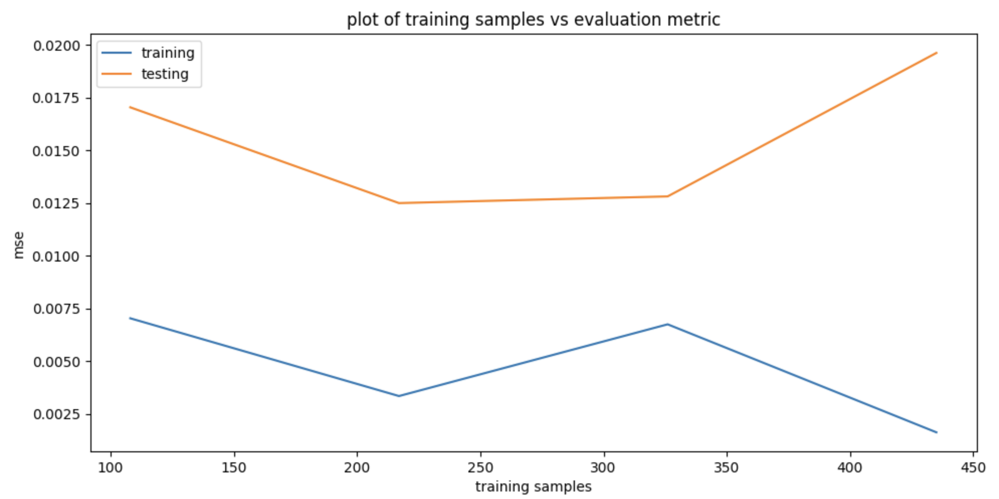
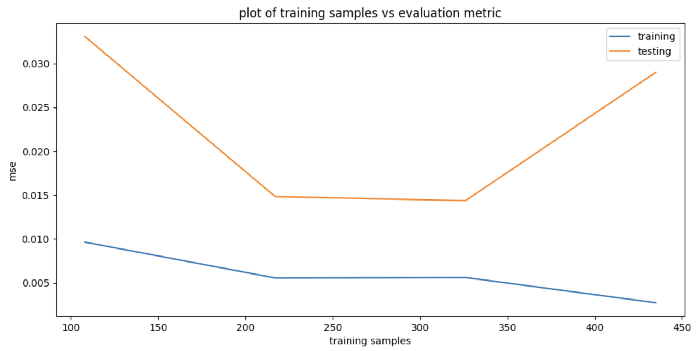

# Robot Learning Assignment 1 Report

## 0. Behaviors to Learn
By watching the demonstration video, we summarize the possible behaviors into 3 settings:

1. Go directly to the Goal, we define the reward function as $e^{-\sqrt{(G - E)^2}}$, the closer the end effector to the goal, the higher the reward.
2. Go to the Goal but avoid the Decoys, we define the reward function as $e^{-(\sqrt{(G - E)^2} - 0.2 \sum_i \sqrt{(D_i - E)^2})}$, the further the end effector to the Decoy, the higher the reward value.
3. Go to the Goal but is attracted to the Decoys, we define the reward function as $e^{-(\sqrt{(G - E)^2} + 0.2 \sum_i \sqrt{(D_i - E)^2})}$, the closer the end effector to the Decoy, the higher the reward value.

## 1. Collaborators

- Eason Ding (This repo is forked from Eason)

- Ziyao Shangguan

- Anushka Potdar

## 2. Algoithm picked

In summary, we picked __TAMER__ and __Bayesian IRL__ in this assignment.

Both TAMER and Bayesian IRL are trying to learn human teacher's reward value. 
- TAMER uses a supervised learning setting to learn human reward explicity.
- Bayesian IRL uses Bayes rule to learn the reward distribution.

### 2.1 TAMER Framework
TAMER originally aims to predict reward function from human demonstration in an online learning setting. However, given that we have the demonstration and for simplicity, we learn the reward function in an offline learning setting. Given the three behaviors mentioned above and the trajectory of the robot, we calculate reward for each task and treat them as the ground truth value for the reward model. Then, we apply a multi-layer perceptron (MLP) to actively learn the r`eward function`. 

Once we have the `reward function`, given the current joint angle, we can calculate the reward value for the current joint angle. The next question is how can we determine the angle movement given the current reward. For simplicity, we apply the brute force searching, i.e., we iterate all possible combination of each joint and calcualte the reward value for each combination, we return the joint angle with the highest reward value. 

### 2.2 Bayesian IRL
Bayesian IRL aims to learn the probability distribution over the space of reward functions in an IRL setting. In Bayesian IRL, we aim to learn $P(Reward|Demonstration)$. We use a maximum a posterior for estimating this objective, i.e., $P(Reward|Demonstration) \propto P(Demonstration|Reward) \cdot P(Reward)$. In this assignment, we assume $P(Reward)$ is in uniform distribution. Then, we only need to estimate $P(Demonstration|Reward)$. In this assignment, we use the original task as our main estimator, i.e., $P(Demonstration|Reward) = e^{-(\hat{R} - \tilde{R})^2}$ where $\hat{R}$ is the reward that we want to learn and $\tilde{R}$ is the reward that we have. Similar to TAMER, we will use a multi-layer perceptron (MLP) to estimate the ground truth reward $\hat{R}$.

## 3. Why Choose TAMER and Bayesian IRL
We choose these two algorithms since these two are the foundation of the current IRL and LfD algorithms. Also, compared to other algorithms, these two algorithms are relatively straightforward, easy to understand, and easy to implement. For novice people like me in ROS, we find that these two algorithms are easy enough to understand and implement in the ROS setting. 

Also, we want to compare the performance of RL and IRL in general.

## 4. Hypothesis

We believe TAMER will work better compared to Bayesian IRL, since we use pre-defined reward value to train an offline reward model. One major blocker for Bayesian IRL is the distribution of the reward value. Since we do not explore all possbile distributions, our hypothesis is ``simply use MLP to learn human reward is more effective``.

## 5. Modification of the Demonstration Data

As we mentioned before, based on the joint angle, we calculate the reward value for each position as follows:
  - Go directly to the Goal, we define the reward function as $e^{-\sqrt{(G - E)^2}}$, the closer the end effector to the goal, the higher the reward.
  - Go to the Goal but avoid the Decoys, we define the reward function as $e^{-(\sqrt{(G - E)^2} - 0.2 \sum_i \sqrt{(D_i - E)^2})}$, the further the end effector to the Decoy, the higher the reward value.
  - Go to the Goal but is attracted to the Decoys, we define the reward function as $e^{-(\sqrt{(G - E)^2} + 0.2 \sum_i \sqrt{(D_i - E)^2})}$, the closer the end effector to the Decoy, the higher the reward value.

The other thing we modify slightly is the relative coordinates of robot's base and the world. Experimentally, we observed that robot's base position w.r.t. the world is  $[-0.2, -0.5, 1.021]$, in other words, end-effector position with respect to the world is: $[-0.2 - \text{end-effector pos wrt robot base}.y, -0.5 + \text{end-effector pos wrt robot base}.x, 1.021 + \text{end-effector pos wrt robot base}.z]$.

## 6. Training Graph

### 6.1 TAMER
We observe that the performance of the reward model is getting better with more training samples. However, there's an overfitting when surpasses around 325 training samples. 

### 6.2 Bayesian IRL
Similar above.

### 6.3 Recommendations 
I would recommend Bayesian IRL if we do have prior knowledge about the distribution of the reward function, otherwise I would recommend an offlien TAMER framework.

## Results Interpretation
Our recording is here **[screen recording](ComleteFailure.webm)**. However, the robot does not perform well as we expected. One possbile explanation is there might not be enough training samples for estimating the reward value.

# README

* The **[assign_reward](assign_reward)** folder contains the code to assign reward to end-effector trajectories. The assigned rewards are saved inside the **[reward](reward)** folder.
* The **[bayesianIRL](bayesianIRL)** folder contains 4 models that trained with different training size (108, 217, 326, 435 samples). Each model takes in 22 numbers as input, and output 3 numbers that correspond to the rewards calculated for 3 different behaviors. **[bayesianIRL.py](bayesianIRL/bayesianIRL.py)** is Bayesian IRL.
* **[display.py](bayesianIRL/display.py)** contains the code to display the training and testing evaluation.
* **[train.py](bayesianIRL/train.py)** contains the code that trains the model.
* The **[config](config)** is the simulation model.
* The **[planning](planning)** is for running the simulation and execute the expert trajectory. We modified the code inside **[xarmJointPlanningClient.py](planning/xarmJointPlanningClient.py)** so that it can save the end-effector position to **[eefPlanning](eefPlanning)** while executing the expert's trajectory.
* The **[tamer](tamer)** folder contains 4 models that trained with different training size (108, 217, 326, 435 samples). Each model takes in 22 numbers as input, and output 3 numbers that correspond to the rewards calculated for 3 different behaviors.
* **[tamer.py](tamer/tamer.py)** contains the code to run the TAMER policy.
* **[display.py](tamer/display.py)** contains the code to display the training and testing evaluation.
* **[train.py](tamer/train.py)** contains the code that trains the model.

